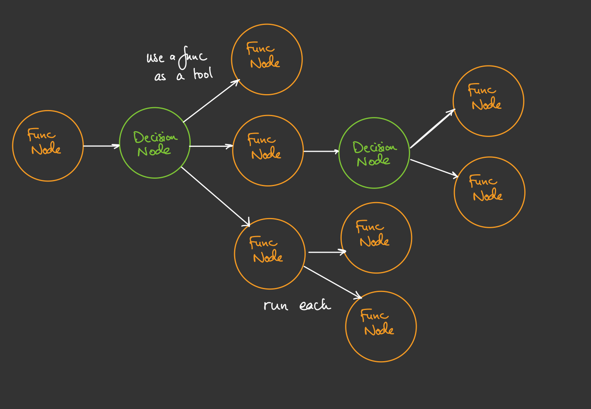

# DAGent - Directed Acyclic Graphs (DAGs) as AI Agents


## How to Use

### Install the lib 
`pip install dagent`

### DAGent basics 

`DecisionNode`
- This is where the llm picks a function to run from given options
- The `.compile()` method autogenerates and saves tool descriptions run with param `force_load=True` if there are errors or if an option of tool changes

`FunctionNode`
- Runs a python function
- Can be attached to a `DecisionNode` to be treated as a tool and allow an LLM to choose what to run

### Dagent Diagram



### Example Usage
See [dagent/examples/simple_agent.py](dagent/examples/simple_agent.py) for more info

1. Put all functions to be run into nodes

```python
def add_two_nums(a: int, b: int) -> int:
    return a + b

add_two_nums_node = FunctionNode(func=add_two_nums)
```
2. If you want any decision making steps, each needs to be a node

```python
decision_node1 = DecisionNode()
# decision_node2 = DecisionNode()
```

2. Link the appropriate nodes together

While writing this out I feel this will become cumbersome to do/track so I'll improve this piece
```python
decision_node1.next_nodes = {
    add_two_nums_node.func.__name__: add_two_nums_node,
    multiply_two_nums_node.func.__name__: multiply_two_nums_node,
}
```

3. Run the `.compile()` method

- Make sure to run this on the first function, the rest will get compiled as well
- It will save json for the tools it has compiled for the attached functions
```python
decision_node1.compile()
```

4. Run the entry function
```python
decision_node1.run()
```


### Other things to know

- `prev_output` is needed in the function signature if you want to use the value from the prior function's value. Obviously the prior function should have returned something for this to work
- Args can be overriden at any time using the following (this merges the kwargs in the background with priority to the user):
```python
add_two_nums_node.user_params = {
    a : 10
}
```


## Motivation

- I found it difficult to use existing libraries and spend the extra time learning a framework to build an "agent"
- Was spending too much time reading their docs and writing agents manually was just faster
- So I built a framework to deal with all the things I didn't like about agents and help me structure code to be build agents quickly


## Things I am looking into (I have lots of opinions)
- [ ] Use "layers" to track next nodes instead of linkedlist style - not gonna do this prematurely :)
- [ ] Probably need a way to return a value directly from a top level run function
- [ ] Look if things run in memory and how to isolate for large workflows -> e.g. funcA(funcB(...)) -> funcA(...) -> funcB(...)
- [ ] Side effects/mutations
- [ ] Creating a data model for communication between functions + schema validation -> autogenerate? 
- [ ] Logging
- [ ] Alerting on error
- [x] Add a compile method to derive data models and tool descriptions